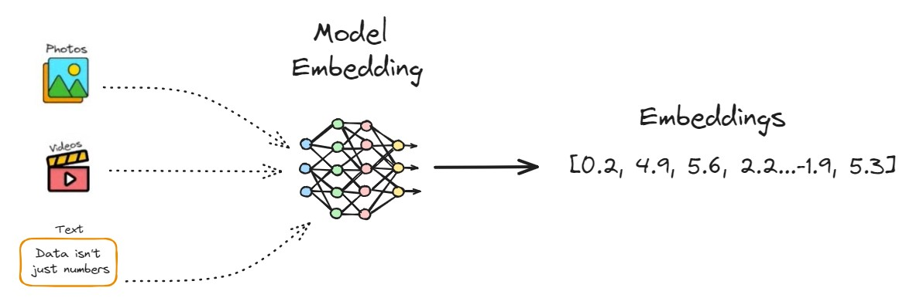
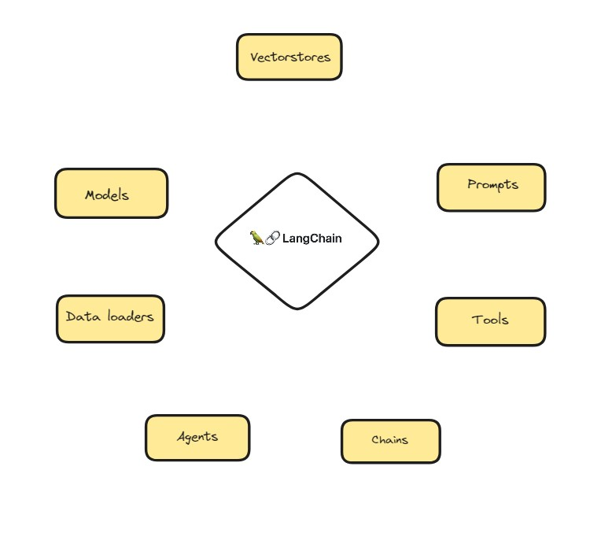

## Practical use of LangChain for integrating LLMs with vector database

**LangChain** is a framework that facilitates the integration of LLMs into larger, more complex applications.

**Vector databases** are designed to store and manage high-dimensional data such as vectors. They are used to represent complex data characteristics, such as images, texts and product recommendations. 

- Embeddigns: vector representation of real word objects such as words, texts, images and etc that capture the semantic meaning of words

There are several AI models that create these embeddings aim to make words that have a similar context close together within a mathematical space.

Unlike traditional relational databases, they are optimized for similarity search operations, facilitating fast and efficient retrieval of similar items within large data sets.

How is it stored?

*Vector Index* | *Metadata Index* | *Embeddings*

In this repository you will find practical application of LLM's using vector databases with the integration of LangChain.

  

